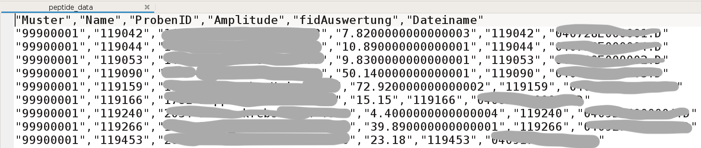

# ETL of peptidomic data using *Dask*

The project examplifies the use of ***Dask*** in processing of **larger-than-memory datasets**. This kind of datasets is impossible to be opened using Excel, and slow using *Pandas*. With *Dask*, which provides multi-core execution, it only takes less than one minute, to **aggregate and filter** data containing millions of rows, and to **write** the results in parquets: all on a single laptop.  The tutorial of *Dask* can be found here: [official-dask](https://docs.dask.org/en/latest/).

## Project Overview

The goal of this project is to identify **peptide biomarkers** related to **kidney dysfunction** in 10000​ patients with different levels of kidney function. There are several steps:

1. **Extract and filter** the peptidomic data from the internal **relational database**
2. **Transform** the peptidomic data  in the forms of **pivot table** (peptide * patients)
3. **Normalise** the peptidomic data
4. **Regress** the peptide intensity aganist *eGFR*, which is a measurement of kidney function, while correctin for **confounders** (age, sex, history of disease)
6. Analyse the distribution of **errors** in regression

### Tools

We will use the following Python libraries:

* ***dask.dataframe*** to process the large peptidomic data
* ***Pandas*** for basic data analysis and cleaning
* ***statsmodels*** for regressional analysis of peptides vs eGFR
* ***Matplotlib*** and ***Seaborn*** for plotting

## Data

All data curated from relational database are stored under `/data/original/`.

### Peptidomic data

There are more than 25000​ measurable peptides in one sample from a patient, therefore the total size of peptidomic data is large (from a few to tens of gigabytes, so *larger than memory*). **It is too large to be efficiently handled by *Pandas*, which motivates the use of *Dask*.** 

A screen shot of the first few lines:

### Clinical data

The clinical data contain the clinical parameters such as age, sex, eGFR from the patients, which I queried from the relational database. They need to be "cleaned" to satisfy the inclusion criteria.

## Codes

All python codes are stored under `/python/`directory.

All results generated by codes are stored under `/data/curated/`direcotry.

### 1. Processing of clinical data

#### `PATIENT_1_clean_data.ipynb`

* Filter the patients so that every patient must have age, sex, eGFR available
* The clinical parameters must be curated so that they are within a physiological range (e.g. age>1000 should be removed)

#### `PATIENT_2_IDA.ipynb`

* DA (initial data analysis) to look at **missingness** of all variables,
* check the **normality** of age, eGFR, acr with visualisation
* check if incidence of diseases is balanced between males and females

#### `PATIENT_3_IDA.ipynb`

* IDA to look at distributino of uCreat and acr **per study group**,
* and visualise the distribution in **histogram**

### 2. ETL of peptidomic data

#### `PEPTIDE_1_reduction.ipynb`

* A pipeline to filter 

	1. Patients recorded in **clinical data** (as we cleaned above)

	2. **Sequenced** peptides from 1)
	3. Peptides which pass a certain **frequency threshold** from 2). The default is to appear in at least 50% of patients.

* Export the filtered results to parquet files

#### `PEPTIDE_2_pivot.ipynb`

* A pipeline to transform the parquet files to pivot format (which is easier for regression)
* Normalise the data with three options: logarithmic, rank-normalisation, or not doing anything
* Export the results to csv

### 3. Statistical analysis

#### `OLS.py` and `OLS_1_regression.ipynb`

* Join the peptidomic (contain peptide intensity) and clinical data (contain eGFR)
* **Regression** the peptide intensity aganist *eGFR*, corrected for age, sex, diseases
* Ajust the significance level for **multiple-testing** according to FDR
* Store the regression results (coefficient, adjusted p-values etc) in a csv

#### `OLS.py` and `OLS_2_residue.ipynb`

* check the assumptions of OLS by various plots, that:
	* If the errors are normally distributed (top)
	* If the expected values of erros are 0​ (middle)
	* If the errors have the same variance (bottom)

## Results

The plots are stored under `/figures/`.

#### `PEPTIDE_3_plot.ipynb`

For the most significant peptide, their ln-intensity in four eGFR groups were plotted in a box plot. Here, 0=no kidney function loss, 3=most severe kidney function loss.

For example, it is discovered that the intensity of peptide 1 drops when eGFR drops, while keeping age, sex, disease constant:

## Conclusion and Future Plan

* We could identify X peptides which are significantly correlated to kidney function.
* The significant peptides found will be confirmed at transcription level,  and further examined with pathway analysis.

